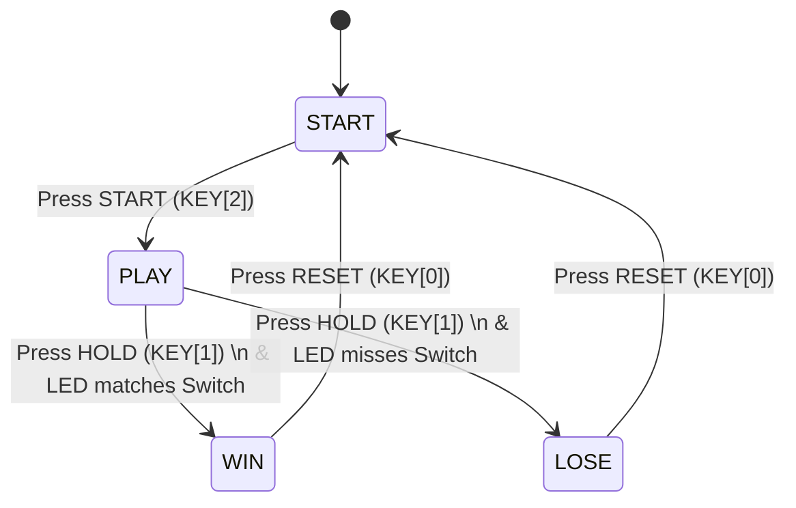
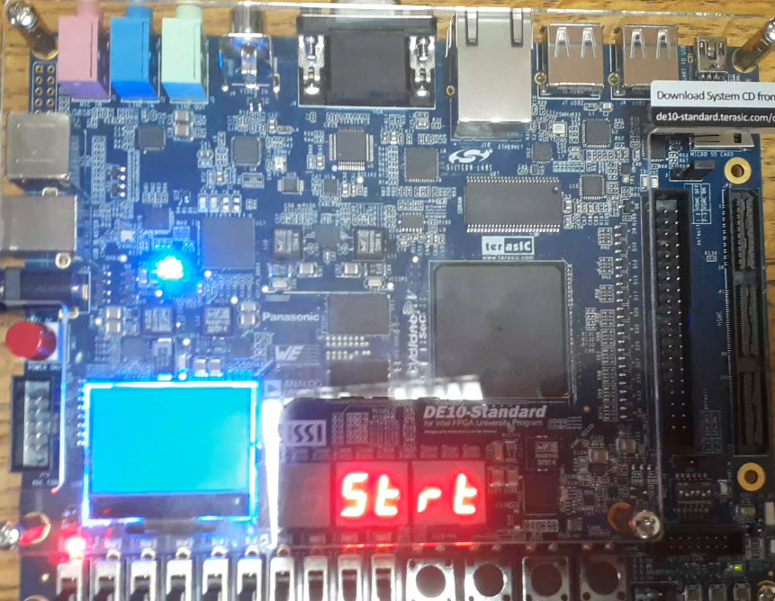
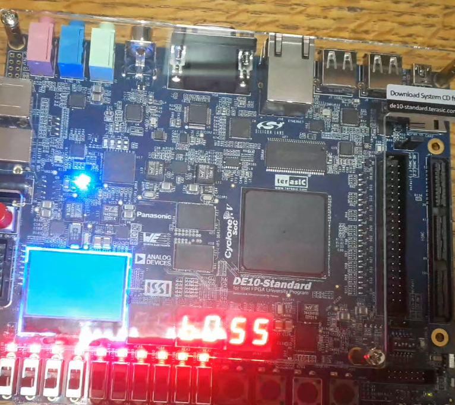
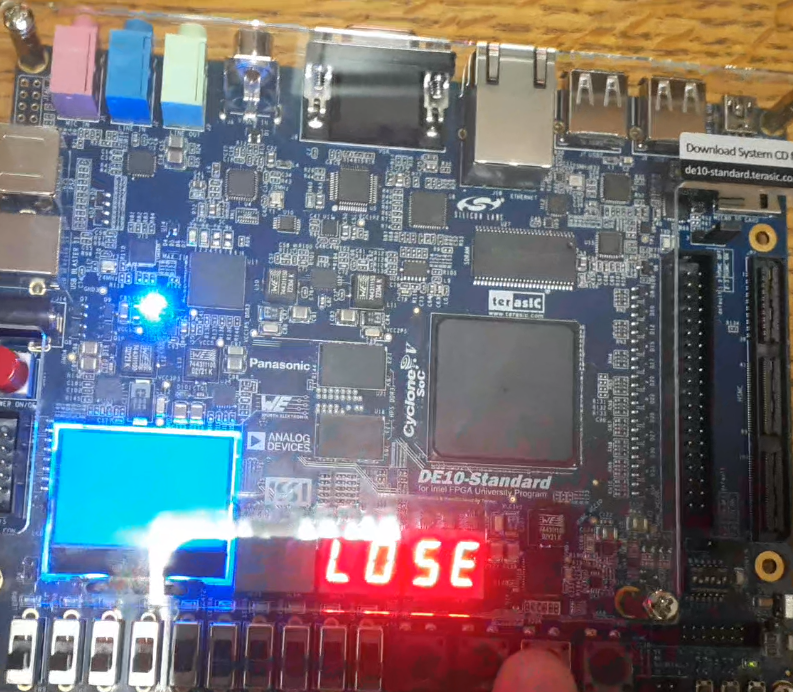

# Stop the Light: FPGA Arcade Game

An interactive, hardware-based arcade game designed in Verilog and implemented on the Intel/Altera DE10-Standard (Cyclone V) development board. 

The game challenges players to test their reaction time by stopping a rapidly bouncing LED exactly inside a player-defined "Winning Zone." It features a custom Finite State Machine (FSM), dynamic visual feedback, and physical switch configurations.

## Key Features

*   **Custom Target Zones:** Players use the 10 physical slide switches (`SW[9:0]`) to configure overlapping hit-boxes.
*   **Ping-Pong Shift Register:** The active LED bounces continuously between the left and right boundaries without falling off the board.
*   **Hardware Referee (FSM):** A precise state machine tracks the physical button presses against the 50MHz clock to guarantee accurate win/loss detection.
*   **Dynamic Visuals:** The 7-segment displays route custom messages (`Strt`, `BOSS`, `LOSE`), and all 10 LEDs flash simultaneously to celebrate a win.

## System Architecture

The design relies on a strictly modular RTL architecture, entirely driven by the native 50 MHz clock with a divided clock enable pulse for shifting.

*   **`top_FPGA_GAME`**: The top-level wrapper mapping internal signals to Cyclone V pins.
*   **`Clk_Div`**: Divides the 50 MHz board clock down to a playable 5 Hz frequency.
*   **`Shift_Reg`**: Handles the bidirectional bouncing logic and full-board LED flashing.
*   **`Game_Controller`**: The FSM referee evaluating the exact overlap between the LED and the slide switches.
*   **`Seven_Seg_Decoder`**: A combinational ROM mapping system states to active-low 7-segment hex codes.

## Game Controller State Machine

The core game logic is controlled by a 4-state FSM. The system locks upon winning or losing to prevent score ghosting and can only be escaped via a hardware reset.

## Hardware Demonstration

| Initialization | Victory State | Defeat State |
| :---: | :---: | :---: |
|  |  |  |
| **START:** The system boots and waits for the player to press `KEY[2]`. | **WIN:** The player successfully stops the LED in the active target zone. | **LOSE:** The player misses the target zone. |

## How to play?
I have uploaded the .sof file so you can just implement it in your Intel/Altera DE10-Standard (Cyclone V) development board and try to beat it.
Also you can make it on any other FPGA just make sure resources are enough and take files and go ahead.
